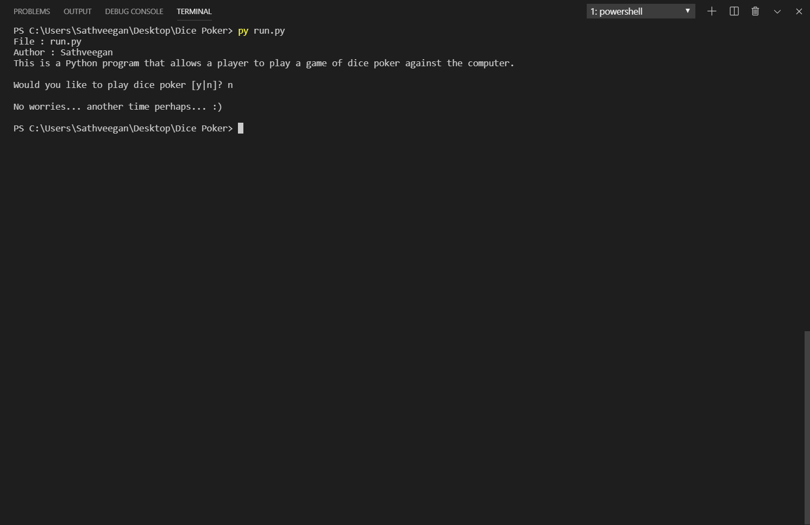
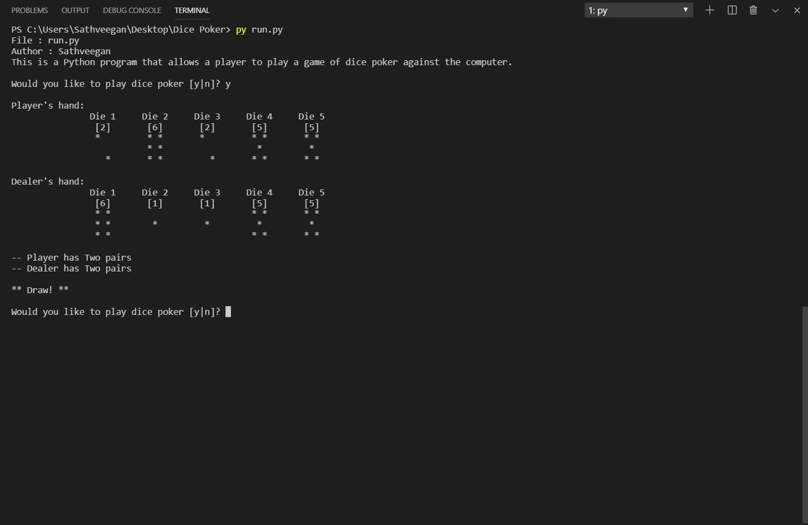
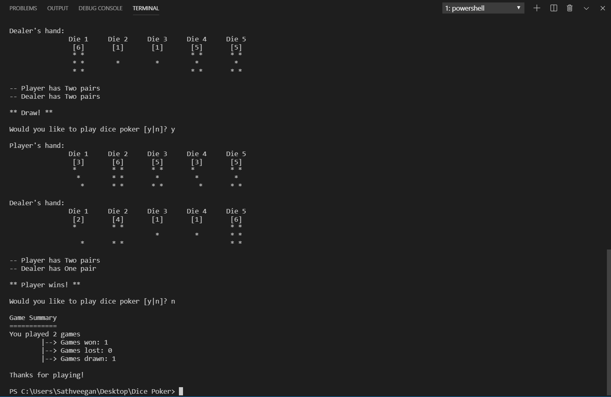

# DICE POKER - PYTHON

```
Develop the Python program that allows a player to play a game of dice poker against the computer.
```

## Method

> First, clone or download the source code from github

> Then, go to the root directory and type `py run.py` 

> Finally, run the Dice Poker game :+1:.

## Screenshots





